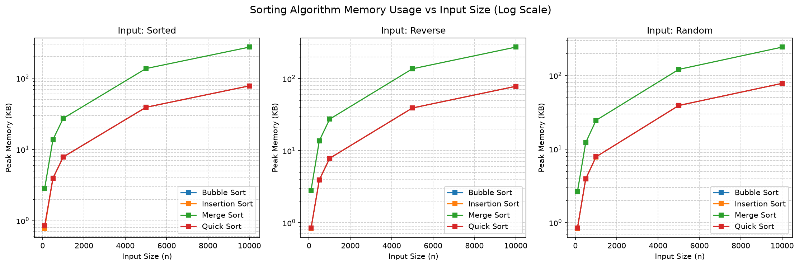
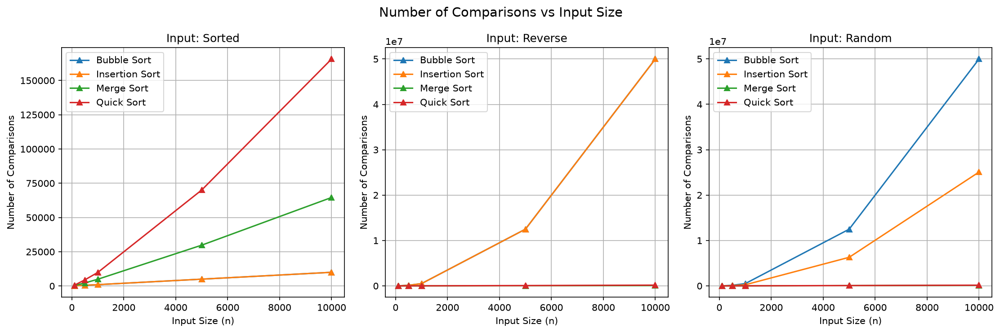

# Design and Analysis of Algorithms Lab (ENCA301)

| Field | Details |
|-------|--------|
| **Author** | Aditya Shibu |
| **Roll Number** | 2401201047 |
| **Course** | BCA (AI & DS) - Section B |
| **Semester** | 5 |
| **University** | K.R. Mangalam University |
| **Submitted To** | Dr. Aarti Sangwan |

## Overview

This repository contains the complete laboratory work for "Design and Analysis of Algorithms" - Lab 1: Comparative Study of Algorithm Efficiency and Performance Analysis. The project implements, benchmarks, and compares four sorting algorithms and three Fibonacci algorithms, analyzing their time complexity, space complexity, and practical performance across varying input sizes and conditions.

## Contents

| File | Description |
|------|-------------|
| `algorithms/sorting.py` | Bubble Sort, Insertion Sort, Merge Sort, Quick Sort implementations |
| `algorithms/fibonacci.py` | Recursive, Iterative, and Dynamic Programming Fibonacci implementations |
| `analysis/performance.py` | Performance measurement utilities (5-run median for time and memory) |
| `analysis/visualizations.py` | Matplotlib plotting functions (log-scale sorting graphs, linear Fibonacci graphs) |
| `notebook/algorithm_efficiency_analysis.ipynb` | Jupyter Notebook with pseudocode, implementations, experiments, and visualizations |
| `notebook/run_analysis.py` | Standalone script to run full analysis |
| `reports/final_report.md` | Detailed analytical report |
| `reports/final_report.pdf` | Final report (PDF) |
| `data/` | CSV files with raw performance data |
| `graphs/` | Generated PNG visualizations |
| `requirements.txt` | Python dependencies |

## Algorithms Implemented

### Sorting Algorithms

| Algorithm | Best Case | Average Case | Worst Case | Space | Stable |
|-----------|-----------|--------------|------------|-------|--------|
| Bubble Sort | O(n) | O(n²) | O(n²) | O(1) | Yes |
| Insertion Sort | O(n) | O(n²) | O(n²) | O(1) | Yes |
| Merge Sort | O(n log n) | O(n log n) | O(n log n) | O(n) | Yes |
| Quick Sort | O(n log n) | O(n log n) | O(n²) | O(log n) | No |

### Fibonacci Algorithms

| Algorithm | Time Complexity | Space Complexity |
|-----------|-----------------|------------------|
| Recursive | O(2ⁿ) | O(n) |
| Iterative | O(n) | O(1) |
| Dynamic Programming | O(n) | O(n) |

## Environment

| Component | Version |
|-----------|---------|
| Python | 3.14 |
| matplotlib | 3.11.1 |
| numpy | 2.5.2 |
| pandas | 3.0.5 |
| memory_profiler | 0.61.0 |
| Jupyter | 7.6.2 |

## How to Run

1. Clone the repository:
   ```bash
   git clone <repository-url>
   cd algorithm-efficiency-case-study
   ```

2. Create and activate virtual environment:
   ```bash
   python -m venv venv
   source venv/bin/activate  # On Windows: venv\Scripts\activate
   ```

3. Install dependencies:
   ```bash
   pip install -r requirements.txt
   ```

4. **Option A - Jupyter Notebook (recommended):**
   ```bash
   jupyter notebook notebook/algorithm_efficiency_analysis.ipynb
   ```
   Run all cells from top to bottom.

5. **Option B - Standalone script:**
   ```bash
   python notebook/run_analysis.py
   ```

6. Generated outputs:
   - `graphs/` - 5 PNG visualizations (sorting graphs on log scale, Fibonacci on linear scale)
   - `data/` - CSV performance data with comparison counts

## Measurement Methodology

- Each data point is the **median of 5 runs** to reduce measurement noise
- Execution time measured via `time.perf_counter()`
- Memory usage measured via `tracemalloc`
- Comparisons counted internally by each sorting algorithm
- Quick Sort uses **randomized pivot selection** to avoid O(n²) worst case on sorted input
- Sorting graphs use a **log-scale y-axis** so that O(n²) and O(n log n) algorithms are both visible; Fibonacci graphs use a linear scale (recursive memory is 0 KB and cannot be shown on a log axis)

## Generated Graphs

### Sorting Algorithm Performance


*Figure 1: Sorting Algorithm Execution Time vs Input Size (Log Scale)*


*Figure 2: Sorting Algorithm Memory Usage vs Input Size (Log Scale)*


*Figure 3: Number of Comparisons vs Input Size (Log Scale)*

### Fibonacci Algorithm Performance


*Figure 4: Fibonacci Algorithm Execution Time vs n*


*Figure 5: Fibonacci Algorithm Memory Usage vs n*

## Notes

- All sorting algorithms return `(sorted_list, comparisons)` tuples for tracking operation counts
- The notebook includes pseudocode blocks for each algorithm as required by the assignment
- The final report (`reports/final_report.md`) contains full analysis with theoretical vs practical discussion
- Input sizes tested: 100, 500, 1,000, 5,000, 10,000 elements
- Input conditions: sorted, reverse-sorted, random
