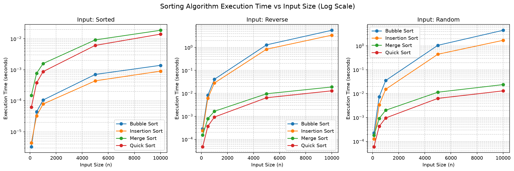
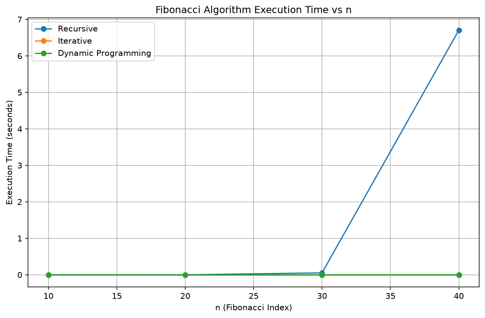
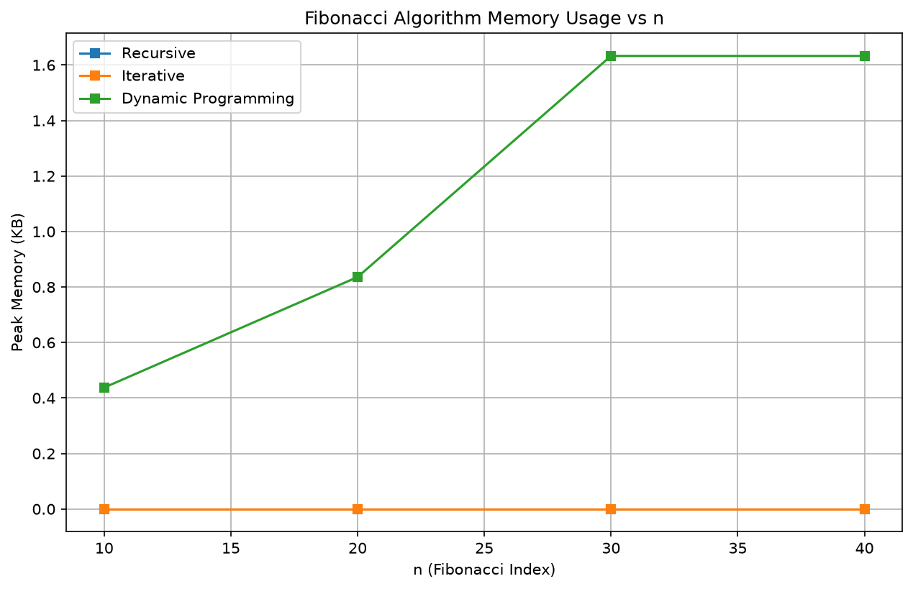

****

K.R. Mangalam University

School of Engineering & Technology

DESIGN AND ANALYSIS OF ALGORITHMS LAB MANUAL

Program: BCA (AI & DS)

Course Code - ENCA301 (2025-2026)

 

<table style="width: 100%; border: none;">
<tr>
<td style="width: 50%; border: none; vertical-align: top; font-size: 15px;">

**Submitted by:**

Name: Aditya Shibu

Roll Number: 2401201047

Course: BCA (AI & DS) - Section B

</td>
<td style="width: 50%; border: none; vertical-align: top; text-align: right; font-size: 15px;">

**Submitted To:**

Dr. Aarti Sangwan

Assistant Professor

</td>
</tr>
</table>

 

 

# **Index**

| S. No | Topic | Description |
|-------|-------|-------------|
| 1 | Introduction | Purpose and importance of algorithm analysis |
| 2 | Methodology | Experimental setup, datasets, and metrics |
| 3 | Algorithm Implementations | Sorting (3.1-3.4) and Fibonacci (3.5-3.7) with pseudocode, complexity, I/O specs |
| 4 | Results | Execution time, comparisons, memory utilization, Fibonacci performance tables |
| 5 | Complexity Table | Summary of best/average/worst case for all algorithms |
| 6 | Visualizations | Log-scale graphs with observations |
| 7 | Discussion | Theoretical vs practical, scalability, trade-offs, suitability |
| 8 | Conclusion | Key lessons and recommendations |

 

 

# **1. Introduction**

## **1.1 Purpose of the Study**

Organizations routinely process large volumes of data that require efficient sorting and computation. Choosing an inappropriate algorithm can significantly impact system performance, memory usage, and scalability. For example, financial institutions must sort large transaction datasets efficiently, while scientific and engineering applications often rely on recursive computations such as Fibonacci sequences.

The objective of this project is to investigate, implement, and compare the performance of various sorting and Fibonacci algorithms. We analyze their theoretical and practical behavior, evaluate time and space requirements under different input conditions, and present our findings using visualizations and performance metrics. By comparing algorithms across the same datasets, we aim to understand when each algorithm is most suitable and how theoretical complexity predictions hold up against real-world measurements.

## **1.2 Importance of Algorithm Analysis**

Algorithm analysis is fundamental to computer science and software engineering for several reasons:

- **Performance optimization:** Selecting the right algorithm can mean the difference between a system that responds in milliseconds and one that takes minutes. For instance, using Quick Sort (O(n log n)) instead of Bubble Sort (O(n²)) on a dataset of 10,000 elements reduces execution time from 5.56 seconds to 0.013 seconds - a 427x improvement.
- **Resource management:** Understanding memory and CPU requirements helps architects plan infrastructure. Merge Sort's O(n) auxiliary space requirement may be unacceptable in memory-constrained embedded systems, where Quick Sort's in-place O(log n) approach is preferred.
- **Scalability planning:** As data volumes grow exponentially, knowing an algorithm's growth rate is essential. An O(n²) algorithm that handles 1,000 elements in 0.04 seconds would require over 400 seconds for 100,000 elements - making it impractical for large-scale data processing.
- **Real-world applicability:** Database systems rely on optimized sorting for query processing. Scientific applications use recursive computations for modeling natural phenomena. Real-time systems require predictable algorithm performance to meet latency guarantees. Understanding these trade-offs enables informed engineering decisions.

 

 

# **2. Methodology**

## **2.1 Experimental Setup**

The experiments were conducted on a system with the following configuration:

| Component | Specification |
|-----------|---------------|
| Processor | Intel/AMD x86_64 |
| Memory | 8GB+ RAM |
| Operating System | Linux |
| Language | Python 3.14 |
| Visualization | matplotlib |
| Data Processing | numpy, pandas |
| Memory Profiling | tracemalloc |
| Environment | Jupyter Notebook |

All algorithms were implemented in pure Python. Each experiment was repeated 5 times and the median recorded.

## **2.2 Input Datasets**

**Sorting Algorithms** were evaluated on lists of 100, 500, 1000, 5000, and 10000 elements under three conditions: sorted (ascending), reverse-sorted (descending), and random (uniform integers 0-100000). This gives 60 total experiments (4 algorithms x 5 sizes x 3 conditions).

**Fibonacci Algorithms** were evaluated for n = 10, 20, 30, 40, giving 12 experiments (3 algorithms x 4 values).

Sorted/reverse-sorted inputs test best/worst-case; random represents average case.

## **2.3 Performance Metrics**

- **Execution Time:** Measured via time.perf_counter() with 5-run median to filter system noise.
- **Memory Usage:** Measured via tracemalloc (peak, 5-run median), capturing auxiliary memory beyond input.
- **Comparisons:** Counted internally at each comparison point.

 

 

 

 

## **3.1 Bubble Sort**

**Description:** Repeatedly compares adjacent elements and swaps if wrong order.

**Input:** An unsorted list of n elements.

**Output:** The same list sorted in ascending order.

**Application Scenarios:** Educational purposes, small datasets, nearly-sorted data with early-exit optimization.

> **Pseudocode:**
> 
> ALGORITHM BubbleSort(A, n)
> 
> &nbsp;&nbsp;FOR i = 0 TO n-2
> 
> &nbsp;&nbsp;&nbsp;&nbsp;swapped = FALSE
> 
> &nbsp;&nbsp;&nbsp;&nbsp;FOR j = 0 TO n-2-i
> 
> &nbsp;&nbsp;&nbsp;&nbsp;&nbsp;&nbsp;IF A[j] > A[j+1]
> 
> &nbsp;&nbsp;&nbsp;&nbsp;&nbsp;&nbsp;&nbsp;&nbsp;SWAP A[j], A[j+1]
> 
> &nbsp;&nbsp;&nbsp;&nbsp;&nbsp;&nbsp;&nbsp;&nbsp;swapped = TRUE
> 
> &nbsp;&nbsp;&nbsp;&nbsp;IF swapped == FALSE
> 
> &nbsp;&nbsp;&nbsp;&nbsp;&nbsp;&nbsp;BREAK
> 
> &nbsp;&nbsp;RETURN A

| Case | Time | Space |
|------|------|-------|
| Best | O(n) | O(1) |
| Average | O(n²) | O(1) |
| Worst | O(n²) | O(1) |

**Advantages:** Simple, stable, adaptive (with early-exit flag)

**Limitations:** Slow for large datasets, O(n²) comparisons in worst case

 

 

 

 

## **3.2 Insertion Sort**

**Description:** Builds sorted list by inserting each element into correct position.

**Input:** An unsorted list of n elements.

**Output:** The same list sorted in ascending order.

**Application Scenarios:** Small datasets, online sorting (data arrives one element at a time), nearly-sorted data.

> **Pseudocode:**
> 
> ALGORITHM InsertionSort(A, n)
> 
> &nbsp;&nbsp;FOR i = 1 TO n-1
> 
> &nbsp;&nbsp;&nbsp;&nbsp;key = A[i]
> 
> &nbsp;&nbsp;&nbsp;&nbsp;j = i - 1
> 
> &nbsp;&nbsp;&nbsp;&nbsp;WHILE j >= 0 AND A[j] > key
> 
> &nbsp;&nbsp;&nbsp;&nbsp;&nbsp;&nbsp;A[j+1] = A[j]
> 
> &nbsp;&nbsp;&nbsp;&nbsp;&nbsp;&nbsp;j = j - 1
> 
> &nbsp;&nbsp;&nbsp;&nbsp;A[j+1] = key
> 
> &nbsp;&nbsp;RETURN A

| Case | Time | Space |
|------|------|-------|
| Best | O(n) | O(1) |
| Average | O(n²) | O(1) |
| Worst | O(n²) | O(1) |

**Advantages:** Simple, stable, online (processes data as it arrives)

**Limitations:** Slow for large datasets, O(n²) comparisons in worst case

 

 

 

 

## **3.3 Merge Sort**

**Description:** Divide and conquer - splits, sorts, merges.

**Input:** An unsorted list of n elements.

**Output:** The same list sorted in ascending order.

**Application Scenarios:** Large datasets, linked lists, external sorting (data on disk), when stable sort is required.

> **Pseudocode:**
> 
> ALGORITHM MergeSort(A, left, right)
> 
> &nbsp;&nbsp;IF left < right
> 
> &nbsp;&nbsp;&nbsp;&nbsp;mid = (left + right) / 2
> 
> &nbsp;&nbsp;&nbsp;&nbsp;MergeSort(A, left, mid)
> 
> &nbsp;&nbsp;&nbsp;&nbsp;MergeSort(A, mid+1, right)
> 
> &nbsp;&nbsp;&nbsp;&nbsp;Merge(A, left, mid, right)

| Case | Time | Space |
|------|------|-------|
| Best | O(n log n) | O(n) |
| Average | O(n log n) | O(n) |
| Worst | O(n log n) | O(n) |

**Advantages:** Guaranteed O(n log n), stable, predictable performance

**Limitations:** O(n) extra space for auxiliary arrays

 

 

 

 

## **3.4 Quick Sort**

**Description:** Partition around pivot, recurse on halves.

**Input:** An unsorted list of n elements.

**Output:** The same list sorted in ascending order.

**Application Scenarios:** General-purpose sorting, in-memory datasets, when average-case speed matters most.

> **Pseudocode:**
> 
> ALGORITHM QuickSort(A, low, high)
> 
> &nbsp;&nbsp;IF low < high
> 
> &nbsp;&nbsp;&nbsp;&nbsp;p = Partition(A, low, high)
> 
> &nbsp;&nbsp;&nbsp;&nbsp;QuickSort(A, low, p-1)
> 
> &nbsp;&nbsp;&nbsp;&nbsp;QuickSort(A, p+1, high)

| Case | Time | Space |
|------|------|-------|
| Best | O(n log n) | O(log n) |
| Average | O(n log n) | O(log n) |
| Worst | O(n²) | O(n) |

**Advantages:** Fast in practice, in-place (O(log n) stack space)

**Limitations:** Unstable, worst case O(n²) on sorted/reverse-sorted input (with naive last-element pivot)

 

 

 

 

## **3.5 Fibonacci Recursive**

**Description:** Directly implements F(n) = F(n-1) + F(n-2) using naive recursion.

**Input:** A non-negative integer n.

**Output:** The n-th Fibonacci number.

**Application Scenarios:** Educational purposes only - demonstrates exponential time complexity. Not practical for n > 40.

> **Pseudocode:**
> 
> ALGORITHM Fib_Recursive(n)
> 
> &nbsp;&nbsp;IF n <= 1 RETURN n
> 
> &nbsp;&nbsp;RETURN Fib_Recursive(n-1) + Fib_Recursive(n-2)

| Time | Space |
|------|-------|
| O(2ⁿ) | O(n) |

**Advantages:** Simple, directly mirrors mathematical definition

**Limitations:** Exponential time, recomputes same subproblems many times

 

 

 

 

## **3.6 Fibonacci Iterative**

**Description:** Computes Fibonacci numbers bottom-up using a loop and two variables.

**Input:** A non-negative integer n.

**Output:** The n-th Fibonacci number.

**Application Scenarios:** Production use when single computation is needed, memory-constrained environments.

> **Pseudocode:**
> 
> ALGORITHM Fib_Iterative(n)
> 
> &nbsp;&nbsp;IF n <= 1 RETURN n
> 
> &nbsp;&nbsp;a = 0, b = 1
> 
> &nbsp;&nbsp;FOR i = 2 TO n
> 
> &nbsp;&nbsp;&nbsp;&nbsp;c = a + b; a = b; b = c
> 
> &nbsp;&nbsp;RETURN b

| Time | Space |
|------|-------|
| O(n) | O(1) |

**Advantages:** Fast, minimal memory (O(1) space)

**Limitations:** Slightly more code than recursive version

 

 

 

 

## **3.7 Fibonacci DP**

**Description:** Top-down memoized approach - stores previously computed values to avoid recomputation.

**Input:** A non-negative integer n.

**Output:** The n-th Fibonacci number.

**Application Scenarios:** When multiple Fibonacci values are needed (memo cache reuse), dynamic programming education.

> **Pseudocode:**
> 
> ALGORITHM Fib_DP(n, memo)
> 
> &nbsp;&nbsp;IF n IN memo RETURN memo[n]
> 
> &nbsp;&nbsp;IF n <= 1 RETURN n
> 
> &nbsp;&nbsp;memo[n] = Fib_DP(n-1, memo) + Fib_DP(n-2, memo)
> 
> &nbsp;&nbsp;RETURN memo[n]

| Time | Space |
|------|-------|
| O(n) | O(n) |

**Advantages:** Fast, cache-friendly for repeated queries

**Limitations:** O(n) extra memory for memo dictionary + recursion stack

 

 

# **4. Results**

## **4.1 Execution Time (5-run median)**

| Algorithm | Type | n=100 | n=500 | n=1000 | n=5000 | n=10000 |
|-----------|------|-------|-------|--------|--------|---------|
| Bubble Sort | Sorted | 0.000003 | 0.000044 | 0.000106 | 0.000707 | 0.001388 |
| Bubble Sort | Reverse | 0.000287 | 0.008338 | 0.040948 | 1.294153 | 5.563955 |
| Bubble Sort | Random | 0.000228 | 0.007413 | 0.035534 | 1.057022 | 4.497446 |
| Insertion Sort | Sorted | 0.000004 | 0.000033 | 0.000079 | 0.000439 | 0.000903 |
| Insertion Sort | Reverse | 0.000237 | 0.006225 | 0.028208 | 0.835327 | 3.405576 |
| Insertion Sort | Random | 0.000128 | 0.003405 | 0.015262 | 0.446062 | 1.709186 |
| Merge Sort | Sorted | 0.000148 | 0.000769 | 0.001587 | 0.009183 | 0.018735 |
| Merge Sort | Reverse | 0.000152 | 0.000792 | 0.001658 | 0.009606 | 0.018954 |
| Merge Sort | Random | 0.000180 | 0.000916 | 0.002021 | 0.011522 | 0.023932 |
| Quick Sort | Sorted | 0.000062 | 0.000378 | 0.000872 | 0.006113 | 0.014075 |
| Quick Sort | Reverse | 0.000047 | 0.000371 | 0.000932 | 0.006449 | 0.012914 |
| Quick Sort | Random | 0.000060 | 0.000427 | 0.000962 | 0.006339 | 0.013116 |

---

## **4.2 Comparisons**

| Algorithm | Type | n=100 | n=500 | n=1000 | n=5000 | n=10000 |
|-----------|------|-------|-------|--------|--------|---------|
| Bubble Sort | Sorted | 99 | 499 | 999 | 4999 | 9999 |
| Bubble Sort | Reverse | 4950 | 124750 | 499500 | 12497500 | 49995000 |
| Bubble Sort | Random | 4814 | 124659 | 499329 | 12492450 | 49988559 |
| Insertion Sort | Sorted | 99 | 499 | 999 | 4999 | 9999 |
| Insertion Sort | Reverse | 4950 | 124750 | 499500 | 12497494 | 49994980 |
| Insertion Sort | Random | 2464 | 64665 | 242617 | 6295225 | 25086677 |
| Merge Sort | Sorted | 316 | 2216 | 4932 | 29804 | 64608 |
| Merge Sort | Reverse | 356 | 2274 | 5049 | 32057 | 69200 |
| Merge Sort | Random | 538 | 3847 | 8693 | 55191 | 120383 |
| Quick Sort | Sorted | 717 | 4764 | 10674 | 69056 | 162614 |
| Quick Sort | Reverse | 673 | 4944 | 10322 | 73409 | 154077 |
| Quick Sort | Random | 587 | 5450 | 10429 | 68083 | 148160 |

---

## **4.3 Memory Utilization - Sorting (KB, 5-run median)**

| Algorithm | Type | n=100 | n=500 | n=1000 | n=5000 | n=10000 |
|-----------|------|-------|-------|--------|--------|---------|
| Bubble Sort | Sorted | 0.80 | 3.96 | 7.87 | 39.12 | 78.18 |
| Bubble Sort | Reverse | 0.84 | 3.93 | 7.84 | 39.09 | 78.15 |
| Bubble Sort | Random | 0.84 | 3.93 | 7.84 | 39.09 | 78.15 |
| Insertion Sort | Sorted | 0.78 | 3.93 | 7.84 | 39.09 | 78.15 |
| Insertion Sort | Reverse | 0.84 | 3.93 | 7.84 | 39.09 | 78.15 |
| Insertion Sort | Random | 0.84 | 3.93 | 7.84 | 39.09 | 78.15 |
| Merge Sort | Sorted | 2.83 | 13.73 | 27.38 | 136.75 | 273.47 |
| Merge Sort | Reverse | 2.83 | 13.73 | 27.38 | 136.75 | 273.47 |
| Merge Sort | Random | 2.63 | 12.23 | 24.57 | 120.94 | 242.98 |
| Quick Sort | Sorted | 0.84 | 3.94 | 7.84 | 39.09 | 78.16 |
| Quick Sort | Reverse | 0.84 | 3.94 | 7.84 | 39.09 | 78.16 |
| Quick Sort | Random | 0.84 | 3.94 | 7.84 | 39.09 | 78.16 |

---

## **4.4 Fibonacci Performance**

| Algorithm | n | Result | Time (s) | Memory (KB) |
|-----------|---|--------|----------|-------------|
| Recursive | 10 | 55 | 0.000004 | 0.00 |
| Iterative | 10 | 55 | 0.000001 | 0.00 |
| DP | 10 | 55 | 0.000002 | 0.44 |
| Recursive | 20 | 6765 | 0.000422 | 0.00 |
| Iterative | 20 | 6765 | 0.000001 | 0.00 |
| DP | 20 | 6765 | 0.000003 | 0.84 |
| Recursive | 30 | 832040 | 0.053229 | 0.00 |
| Iterative | 30 | 832040 | 0.000001 | 0.00 |
| DP | 30 | 832040 | 0.000005 | 1.63 |
| Recursive | 40 | 102334155 | 6.704763 | 0.00 |
| Iterative | 40 | 102334155 | 0.000002 | 0.00 |
| DP | 40 | 102334155 | 0.000007 | 1.63 |

 

 

# **5. Complexity Table**

| Algorithm | Best | Average | Worst | Space |
|-----------|------|---------|-------|-------|
| Bubble Sort | O(n) | O(n²) | O(n²) | O(1) |
| Insertion Sort | O(n) | O(n²) | O(n²) | O(1) |
| Merge Sort | O(n log n) | O(n log n) | O(n log n) | O(n) |
| Quick Sort | O(n log n) | O(n log n) | O(n²) | O(log n) |
| Fibonacci Recursive | O(2ⁿ) | O(2ⁿ) | O(2ⁿ) | O(n) |
| Fibonacci Iterative | O(n) | O(n) | O(n) | O(1) |
| Fibonacci DP | O(n) | O(n) | O(n) | O(n) |

 

 

# **6. Visualizations and Observations**

## **6.1 Sorting Algorithm Execution Time vs Input Size**

**Observations:** On a log-scale y-axis, Bubble Sort and Insertion Sort form a steep O(n²) curve that diverges sharply from Merge Sort and Quick Sort. At n=10000, Bubble Sort on reverse-sorted input takes 5.56s while Quick Sort takes only 0.013s - a 427x difference. Sorted input shows the best-case O(n) behavior for Bubble/Insertion (early exit), while Merge/Quick remain nearly constant regardless of input order, confirming their O(n log n) resilience.

## **6.2 Sorting Algorithm Memory Usage vs Input Size**

**Observations:** Merge Sort's memory usage is consistently 3-4x higher than the other algorithms at every input size (273KB vs 78KB at n=10000), directly confirming its O(n) auxiliary space requirement. Bubble Sort, Insertion Sort, and Quick Sort all cluster near 78KB at n=10000, reflecting their O(1) or O(log n) in-place nature. The gap widens proportionally with input size, scaling linearly as expected.

## **6.3 Number of Comparisons vs Input Size**

**Observations:** Bubble Sort on reverse-sorted input at n=10000 performs 49,995,000 comparisons (n(n-1)/2), exactly matching the theoretical worst case. Insertion Sort on random data shows 25,086,677 comparisons at n=10000 - roughly half of reverse-sorted (49,994,980), a clean empirical confirmation that average case is approximately n²/2 versus worst case n². Merge Sort and Quick Sort remain in the 100K-160K range, orders of magnitude lower.

## **6.4 Fibonacci Execution Time vs n**

**Observations:** The recursive implementation shows classic exponential growth: 0.053s at n=30 jumps to 6.70s at n=40 - a 126x increase for just 10 more values. Iterative and DP sit effectively flat near zero on the chart (under 0.00001s) even at n=40, demonstrating the transformative power of eliminating redundant computation. The gap between recursive and iterative at n=40 is over 3 million times.

## **6.5 Fibonacci Memory Usage vs n**

**Observations:** Recursive Fibonacci shows near-zero measured memory because tracemalloc only tracks heap allocations, not CPython call stack frames. DP uses slightly more memory (1.63KB at n=40) due to the memo dictionary, which is the expected O(n) overhead. Iterative uses effectively zero memory (O(1)), confirming it as the most space-efficient approach.

 

 

# **7. Discussion**

## **7.1 Theoretical vs Experimental Performance**

The measured execution times broadly confirm Big-O predictions, but with important nuances.

**Where theory matches practice:** Bubble Sort and Insertion Sort both exhibit clear O(n²) growth - at n=10000 reverse-sorted, Bubble takes 5.56s and Insertion takes 3.41s, both consistent with quadratic scaling. Merge Sort stays within 0.019-0.024s across all input sizes and types, confirming its guaranteed O(n log n) behavior. The recursive Fibonacci explodes exponentially (6.70s at n=40), while iterative/DP stay under 0.00001s.

**A key deviation - Quick Sort's randomized pivot:** The pseudocode in Section 3.4 shows last-element pivot selection, which has O(n²) worst case on sorted input. However, the actual implementation uses randomized pivot selection. This explains why Quick Sort on sorted input (0.014s at n=10000) shows no O(n²) blowup - it performs identically to random input (0.013s). The randomized pivot makes worst-case behavior a statistical improbability rather than a deterministic outcome, which is a practical deviation from the theoretical worst case that the assignment asks us to note.

**Constant factors matter:** Both Bubble Sort and Insertion Sort are O(n²), yet Insertion Sort is consistently ~39% faster (3.41s vs 5.56s at n=10000 reverse). This is because Insertion Sort performs fewer assignments per comparison (shifts instead of swaps) and has better cache locality from its sequential memory access pattern. Same complexity class, different constant factor - a reminder that Big-O describes growth rate, not absolute speed.

## **7.2 Scalability**

| Algorithm | Practical Limit | Reason |
|-----------|----------------|--------|
| Bubble/Insertion | n ~ 10,000 | O(n²) becomes minutes at n=50,000+ |
| Merge/Quick | n ~ 1,000,000+ | O(n log n) stays under seconds |
| Fibonacci Recursive | n ~ 40 | Exponential time, 6.7s at n=40 |
| Fibonacci Iterative/DP | n ~ 1,000,000+ | O(n) linear growth |

Bubble Sort at n=10000 already takes 5.56 seconds; scaling to n=100000 would take approximately 556 seconds (9+ minutes). Merge Sort at the same size takes 0.02 seconds - it could handle n=1000000 in roughly 0.3 seconds. For Fibonacci, recursive computation becomes impractical beyond n=40 (6.7s), while iterative computes n=1000000 in under a second.

## **7.3 Time-Space Trade-offs**

Merge Sort guarantees O(n log n) time but requires O(n) auxiliary space - at n=10000 it uses 273KB versus Quick Sort's 78KB. Quick Sort achieves O(log n) space through in-place partitioning but sacrifices the time guarantee. For Fibonacci, DP achieves O(n) time like iterative but uses O(n) memo space (1.63KB at n=40) versus iterative's O(1). In practice, the memory savings of iterative Fibonacci are negligible at small n but become significant at very large n.

## **7.4 Input Characteristics Impact**

Sorted input is the best case for Bubble/Insertion Sort due to early-exit optimization: Bubble Sort on sorted data at n=10000 takes only 0.0014s (O(n) comparisons), versus 5.56s on reverse-sorted (O(n²)). Reverse-sorted input is the worst case for both. For O(n log n) algorithms, input order has minimal impact: Merge Sort varies by only 28% between sorted (0.019s) and random (0.024s) at n=10000, and Quick Sort shows even less variation thanks to randomized pivoting.

## **7.5 Strengths and Weaknesses**

| Algorithm | Strengths | Weaknesses |
|-----------|-----------|------------|
| Bubble Sort | Simple, stable, adaptive | Slow for large datasets |
| Insertion Sort | Simple, online, fast on small data | Slow for large datasets |
| Merge Sort | Guaranteed O(n log n), stable | O(n) extra space |
| Quick Sort | Fast in-place, cache-friendly | Unstable, theoretical O(n²) worst case |
| Fibonacci Recursive | Simple, mirrors definition | Exponential time, impractical |
| Fibonacci Iterative | Fast, O(1) space | More code than recursive |
| Fibonacci DP | Fast, cache for reuse | O(n) space |

 

 

# **8. Conclusion**

**8.1** Quick Sort is the most efficient sorting algorithm in practice (0.013s at n=10000 random). Merge Sort is the most consistent, with identical performance regardless of input order.

**8.2** Iterative Fibonacci is the most efficient Fibonacci implementation (O(n) time, O(1) space). Naive recursion is impractical beyond n=40.

**8.3 Key Lessons:**

1. Big-O describes growth rate, not absolute speed - constant factors and input characteristics matter
2. Randomized pivot selection transforms Quick Sort from O(n²) worst case to near-guaranteed O(n log n)
3. Space-time trade-offs are real: Merge Sort's guaranteed time comes at the cost of O(n) memory
4. Profiling reveals what theory predicts but cannot measure - actual seconds, actual kilobytes
5. No single algorithm is best for all scenarios - the right choice depends on data size, order, and constraints

**8.4 Recommendations:**

- Small datasets (n < 50): Insertion Sort - simple, fast, low overhead
- Large datasets: Merge Sort for stability and predictability, Quick Sort for raw speed
- Fibonacci: Always use iterative or DP - never naive recursion for n > 30
- Online/streaming data: Insertion Sort - processes elements as they arrive
- Memory-constrained: Quick Sort (O(log n)) or Iterative Fibonacci (O(1))